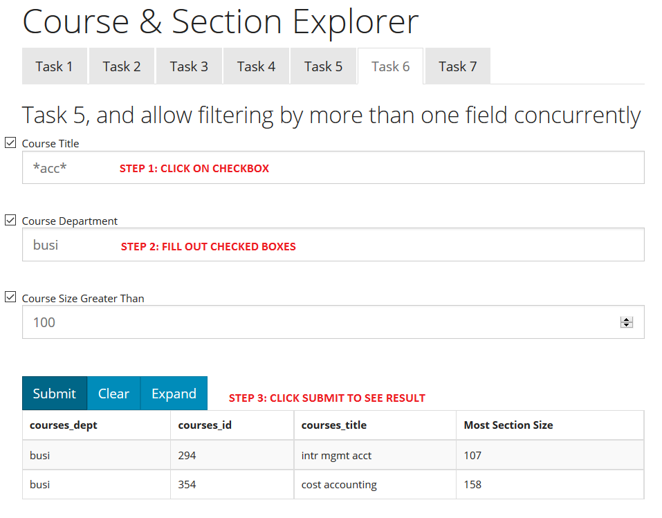
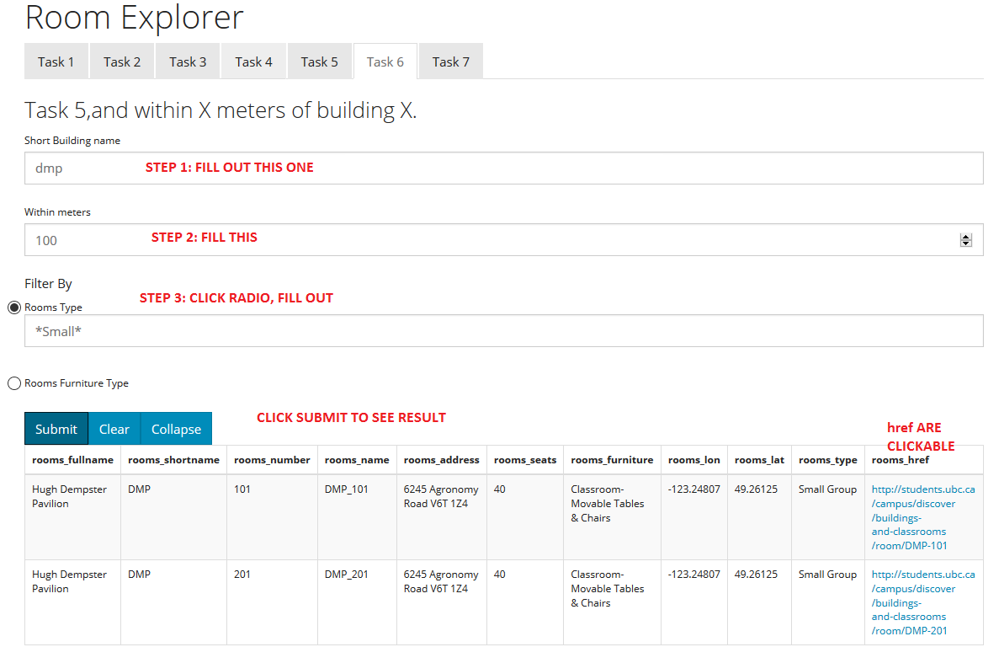
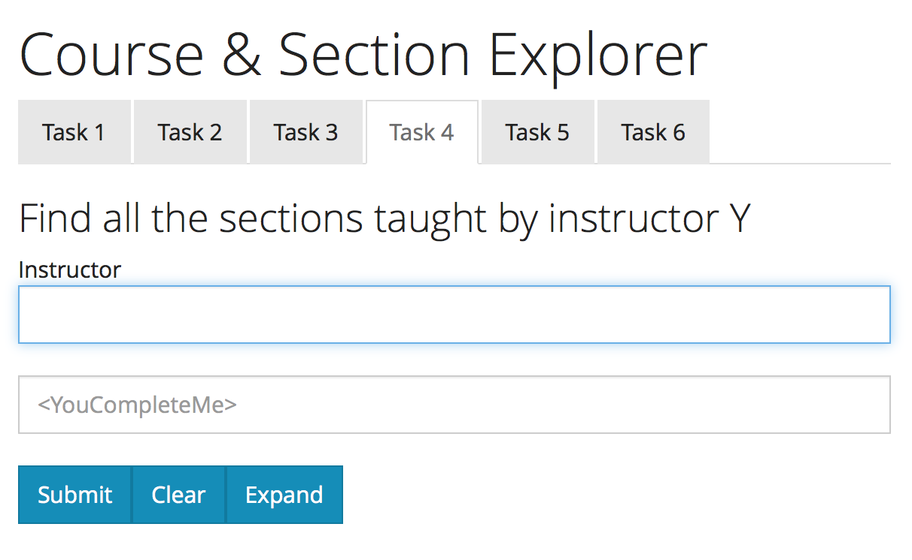
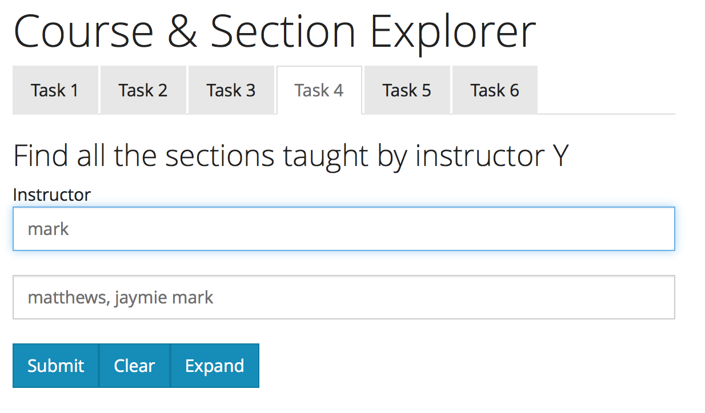
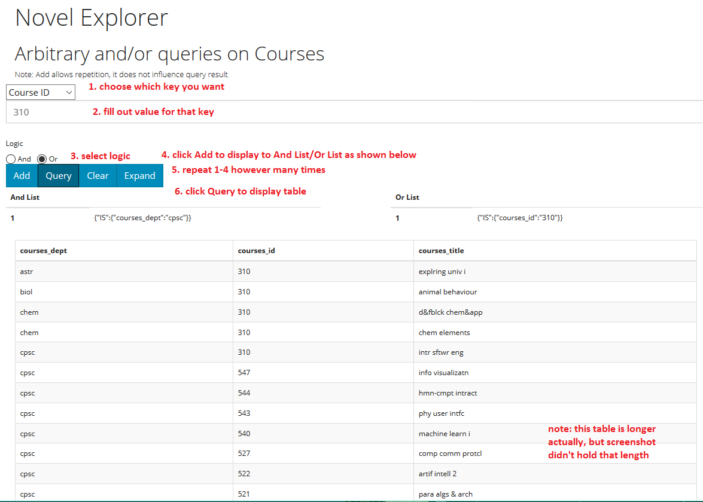

# Setup

> Note: 
> The cache files are stored in side `theCacheInHere`. To use it, do the following: 

> 1. Create a folder `./cache`
> 2. Copy the cache files inside the created folder

### How to run
1. `yarn start server`
2. Use Safari (preferred) or other browser and go to `localhost:4321`
3. `Explore` button goes to Courses Explorer
4. Or you can navigate by clicking on any of the nav bar component.

#Course & Section Explorer
### Buttons
- click `submit` to see resulting table, if there is no result, `oops` will be printed. If a required field is not filled out, red alert box will appear.
- click `cleaer` to clear inputs and outputs
- click `expand` to see the whole table, it will turn into `collapse`, click that to see the smaller table, click again to `Show All`
### Tasks
This contains 7 tasks, click on each task to see what it does
Each task also handles error, and show all possible columns

1. Show all of the sections in department X (with `<YouCompleteMe>`)
2. Show all of the courses in department X ordered by one of most failing, most passing, highest average, lowest average. (with `<YouCompleteMe>`) 
3. Show all of the courses in department X ordered by one or more of most failing, most passing, highest average, lowest average. (with `<YouCompleteMe>`) 
4. Show all the sections taught by instructor Y (with `<YouCompleteMe>`)
5. Show all of the key details for courses in the university one of course titles, department, and sizes.
- Note: key details assumed to be `courses_dept`,`courses_id`,`courses_title`, because all other keys are different according to sections, and this is for courses.
6. Show all of the key details for courses in the university one or more of course titles, department, and sizes.
7. Added to search course ID, with the optional input of department (with `<YouCompleteMe>`)

E.g.

#Room Explorer

### Buttons
- same as `Course & Section Explorer` buttons

### Tasks
This contains 7 tasks, click on each task to see what it does
Each task also handles error, and show all possible columns

1. Show all rooms in building X (with `<YouCompleteMe>`)
2. Show all rooms within X meters of building X 
3. Show all rooms over size X
4. Show all rooms over size X within X meters of building X
5. Show all rooms with type X or furniture X
6. Show all rooms with type X or furniture X, and within X meters of building X
7. Added to search Room Number, with optional input of building short name

E.g.

# Scheduler
### How to use Scheduler: 
1. Enter information for `Room Input`
2. Click `AddRoom` to add rooms
3. To add more rooms, one can just enter the information for the new rooms and click `AddRoom` again to append new rooms. 
4. Click `Display Selected` when done adding rooms. (it will show all rooms selected)
5. Do the similar thing for courses to add courses.
6. Click `Fetch Schedule` to submit.
7. Click 'Previous Room' or `Next Room` to look at schedule for each room.

### About notation on time table
- `cpsc110 [1/3] size: 218`
  - expected size: 218
  - current section: 1
  - 3 sections in total
- `WOOD_4 [120]`
 - Room name is WOOD 4
 - Seats: 120

### About `<YouCompleteMe>` Feature: 
- <YouCompleteMe>  feature often have a "suggestion box" under the input filed. 
- For example, in `Room_shortname`, the above field is for user input, and the below is suggested input. When user click on the suggested input, it will replace the current by the suggested.
- When seeing the <YouCompleteMe> symbol, it denotes the feature has been implemented on the input field.

For Example: 

When typing on the filed, the <YouCompleteMe> field will give suggestions: 

Click on the <YouCompleteMe> field will complete the selection. 

### About `Clear` on Scheduler: 
- It will erase all records added so far and clear the table of added courses/rooms.

#Novel Explorer

###How to use
1. Choose which key to use from the `select` box. This version supports the following keys: `Department`, `Course ID`, `Course Title`
2. Enter value
3. Choose logic from `AND`/`OR`
4. Click `Add`
5. Depending on `AND`/`OR`, the added condition will show up on the `And List`/`Or List` respectively
6. Continue Step 1-5 until you are happy with the number of conditions  
7. Click `Query` to see the result table displayed
8. `Expand` same as before in `Course & Section Explorer`
9. `Clear` clears table, inputs, and reset `select` to `Department`

E.g.

